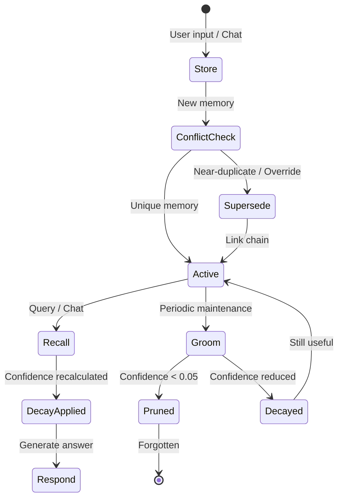

# 🏗 MemoryAgent — System Architecture

> Architecture diagram for the QwenCloud Global AI Hackathon — MemoryAgent Track
> *Also embedded in [README.md](./README.md)*

```mermaid
flowchart TB
    %% ── Styling ──
    classDef browser fill:#e1f5fe,stroke:#0288d1,color:#01579b
    classDef api fill:#fff3e0,stroke:#f57c00,color:#e65100
    classDef core fill:#e8f5e9,stroke:#388e3c,color:#1b5e20
    classDef store fill:#fce4ec,stroke:#d81b60,color:#880e4f
    classDef llm fill:#f3e5f5,stroke:#7b1fa2,color:#4a148c
    classDef ext fill:#fafafa,stroke:#616161,color:#212121,stroke-dasharray: 5 5

    %% ── User Layer ──
    User("👤 User / Browser")
    Dashboard("📊 Dashboard<br/>Chart.js · Force Graph")
    ChatUI("💬 Chat UI<br/>Memory Sidebar")
    User -->|"HTTP POST /chat<br/>GET /dashboard"| ChatUI
    User --> Dashboard

    %% ── FastAPI Layer ──
    subgraph API["🌐 FastAPI Server (uvicorn)"]
        ChatEP["POST /chat<br/>Memory-Augmented Qwen"]
        RecallEP["POST /recall<br/>Retrieve Memories"]
        RememberEP["POST /remember<br/>Store Memory"]
        GroomEP["POST /groom<br/>Memory Maintenance"]
        DecayEP["GET /decay-trace/{id}<br/>Decay Visualization"]
        PrefEP["GET /preferences<br/>Preference History"]
        StatusEP["GET /status<br/>Agent Status"]
        LongEP["POST /chat/long<br/>1M Token Context"]
        TranscriptEP["POST /process-transcript<br/>Document Extraction"]
    end

    ChatUI --> ChatEP
    Dashboard --> StatusEP
    Dashboard --> DecayEP
    Dashboard --> PrefEP

    %% ── Core Service Layer ──
    subgraph Core["🧠 Core Service Layer"]
        MemoryService["MemoryService"]
        subgraph Lifecycle["Memory Lifecycle"]
            Store["store()<br/>✓ Embedding gen<br/>✓ Conflict detection"]
            Recall["recall()<br/>✓ Ebbinghaus decay<br/>✓ Re-rank by conf+sim"]
            Groom["groom()<br/>✓ Decay application<br/>✓ Prune forgotten"]
        end
        subgraph Algorithms["Algorithms"]
            Decay["Ebbinghaus Decay<br/>half_life = 24h × (1 + √access)"]
            Conflict["3-Layer Conflict<br/>Embedding → LLM → Jaccard"]
            Context["Smart Context Window<br/>Score × Budget Selection"]
            PrefLearn["Preference Learning<br/>Evolution Chain"]
        end
    end

    ChatEP --> MemoryService
    RecallEP --> MemoryService
    RememberEP --> MemoryService
    GroomEP --> MemoryService
    DecayEP --> MemoryService
    PrefEP --> MemoryService
    StatusEP --> MemoryService
    LongEP --> MemoryService
    TranscriptEP --> MemoryService

    MemoryService --> Store
    MemoryService --> Recall
    MemoryService --> Groom
    Store --> Conflict
    Recall --> Decay
    Recall --> Context
    Groom --> Decay
    Store --> PrefLearn

    %% ── Storage Layer ──
    subgraph Storage["💾 Storage Layer"]
        SQLite["SQLiteStore<br/>WAL mode · Indexes"]
        FTS5["FTS5 Full-Text Search<br/>rank-based matching"]
        VecSim["Cosine Similarity<br/>NumPy · Embedding vecs"]
    end

    Store --> SQLite
    Recall --> SQLite
    Groom --> SQLite
    SQLite --> FTS5
    SQLite --> VecSim

    %% ── QwenCloud (DashScope) ──
    subgraph Qwen["☁️ QwenCloud / DashScope"]
        ChatModel["qwen-plus<br/>131K context window"]
        LongModel["qwen-max-longcontext<br/>1M token window"]
        EmbedModel["text-embedding-v4<br/>Vector embeddings"]
    end

    ChatEP --> ChatModel
    LongEP --> LongModel
    TranscriptEP --> LongModel
    Store --> EmbedModel
    Recall --> EmbedModel

    %% ── External (pending) ──
    subgraph Future["🔮 Future / Optional"]
        Redis["Redis Backend<br/>Production scaling"]
        VectorIndex["Vector Index<br/>Faster ANN search"]
    end

    SQLize -.-> Redis
    VecSim -.-> VectorIndex
```



## Component Overview

| Layer | Component | Tech | Responsibility |
|-------|-----------|------|----------------|
| **Browser** | Chat UI | HTML + Vanilla JS | Memory-augmented conversation |
| **Browser** | Dashboard | Chart.js + Force Graph | Memory visualization & analytics |
| **API** | FastAPI | 15 endpoints | HTTP interface for all operations |
| **Core** | MemoryService | Python | Store/Recall/Groom lifecycle |
| **Core** | Ebbinghaus Decay | Math | Confidence decay over time |
| **Core** | Conflict Detection | 3-Layer Pipeline | Dedup & preference evolution |
| **Core** | Context Selection | Scoring Algorithm | Token-budgeted memory selection |
| **Storage** | SQLiteStore | SQLite + FTS5 | Persistent storage with search |
| **LLM** | QwenCloud API | DashScope | Chat + Embedding + Long-context |

## Data Flow: Chat with Memory

```
User: "What's my favorite color?"
  │
  ▼
POST /chat {agent_id, message}
  │
  ├─ 1. Embed query → text-embedding-v4
  ├─ 2. Recall relevant memories (vector sim × confidence)
  ├─ 3. Apply Ebbinghaus decay to confidence scores
  ├─ 4. Smart-select top memories within 8K token budget
  ├─ 5. Inject as context → qwen-plus
  │     "Known preferences: [user likes blue]"
  ├─ 6. Generate answer with memory context
  ├─ 7. Extract new memories from conversation
  └─ 8. Store with conflict detection (LLM dedup)
  │
  ▼
Response: "Your favorite color is blue! 🎨"
```

## Memory Lifecycle


