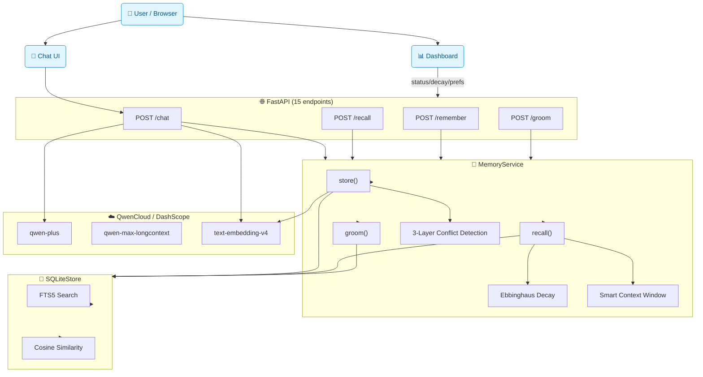
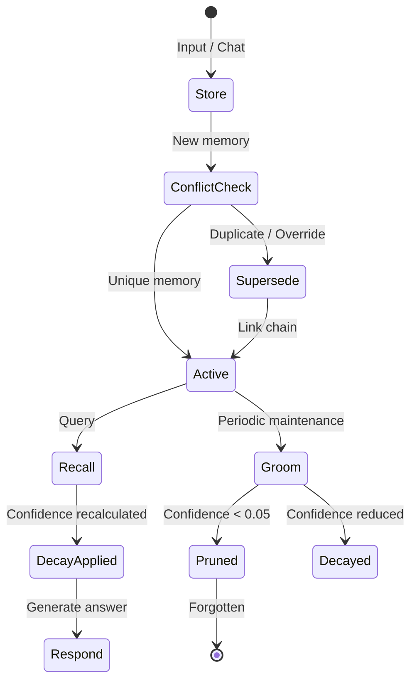

# 🧠 MemoryAgent — Persistent AI Memory Layer

> **Global AI Hackathon with QwenCloud — MemoryAgent Track**
>
> A production-ready memory middleware that gives LLMs durable, evolving memory
> across sessions and agents. Built on QwenCloud (DashScope), featuring
> Ebbinghaus-inspired confidence decay, semantic conflict resolution,
> preference learning, and 1M-token long-context processing.

---

## ✨ Key Features

| Feature | Description |
|---------|-------------|
| **Store → Recall → Groom** | Full memory lifecycle with automatic maintenance |
| **Ebbinghaus Decay** | Confidence fades over time; frequent access slows forgetting (half-life = 24h × √(1 + access_count)) |
| **Conflict Resolution** | Three-layer detection: embedding cosine similarity → LLM semantic comparison → Jaccard fallback |
| **Cross-session Persistence** | Session A's memories survive to Session B via SQLite + FTS5 |
| **Preference Learning** | Automatically extracts and evolves user preferences from conversation |
| **1M Token Context** | Leverages `qwen-max-longcontext` for processing entire documents/transcripts |
| **Smart Context Window** | Selects most relevant memories within token budget |
| **Multi-Agent Isolation** | Each agent has its own isolated memory space |

---

## 🏗 Architecture

> See [ARCHITECTURE.md](./ARCHITECTURE.md) for full diagrams (Mermaid — renders on GitHub).



### Memory Lifecycle



---

## 🚀 Quick Start

### Prerequisites

- Python 3.11+
- QwenCloud API key (free tier: 1M input + 1M output tokens)

### Installation

```bash
# Clone & enter
cd qwen-memoryagent

# Create virtualenv
python3 -m venv .venv
source .venv/bin/activate

# Install
pip install -e ".[all]"

# Set up API key
cp .env.template .env
# Edit .env with your QWEN_API_KEY
```

### Run

```bash
# Start server
./run.sh
# → http://localhost:8000
```

### Run Demo

```bash
# Local demo (no server needed)
python demo.py

# Server demo
python demo.py --server
# In another terminal:
python demo.py --api http://localhost:8000
```

---

## 📡 API Reference

### Memory Operations

| Method | Endpoint | Description |
|--------|----------|-------------|
| POST | `/remember` | Store a new memory |
| POST | `/recall` | Retrieve relevant memories |
| POST | `/chat` | Chat with memory-augmented Qwen |
| POST | `/chat/long` | Chat with 1M token context support |
| DELETE | (via service) | Forget a memory |

### Analysis & Visualization

| Method | Endpoint | Description |
|--------|----------|-------------|
| GET | `/decay-trace/{id}` | Confidence decay curve for one memory |
| GET | `/decay-analysis` | Decay state across all memories |
| GET | `/preferences` | Active preferences |
| GET | `/preferences/history` | Preference evolution chain |

### Maintenance

| Method | Endpoint | Description |
|--------|----------|-------------|
| POST | `/groom` | Run memory maintenance (decay + prune) |
| GET | `/status` | Agent memory status |
| POST | `/process-transcript` | Extract memories from long documents |

---

## 📊 Core Algorithms

### Ebbinghaus Confidence Decay

```
half_life = 24h × (1 + √access_count)

decay_factor = {
    never_accessed: max(0, 1 − (age/24h)^0.7)
    accessed:       2^(−age / half_life)   [exponential decay]
}
```

### Conflict Detection (3 Layers)

1. **Embedding Cosine** — vector similarity via `text-embedding-v4`
2. **LLM Semantic** — Qwen determines: near_duplicate / preference_override / contradiction / related / unrelated
3. **Jaccard Fallback** — word overlap ratio

### Smart Context Selection

Memories are scored by `confidence × (0.6 + 0.4 × recency) × type_bonus`, then greedily selected within token budget. Preferences/Goals get a 1.2× bonus.

---

## 🧪 Test Coverage

```
25 tests — all passing

TestMemoryStore       5/5  ✅  Core CRUD lifecycle
TestConflictResolution 3/3  ✅  Near-duplicate & preference supersession
TestGrooming          2/2  ✅  Decay application & agent isolation
TestDecayTrace        5/5  ✅  Visualization, factor math, analysis
TestPreferenceHistory 2/2  ✅  Evolution tracking
TestSemanticSimilarity 4/4  ✅  Jaccard edge cases
TestLLMClientHelpers  4/4  ✅  Token estimation, smart selection
```

---

## 📁 Project Structure

```
src/memory_agent/
├── models.py              — MemoryRecord, SessionState, RecallResult
├── main.py                — FastAPI application (15 endpoints)
├── storage/
│   └── __init__.py        — SQLiteStore with FTS5 + cosine similarity
├── services/
│   ├── memory_service.py  — Core lifecycle (store/recall/groom/decay/conflict)
│   └── llm_client.py      — QwenCloud client + long-context + smart selection
tests/
├── test_memory.py         — 25 tests covering all modules
demo.py                    — 6-phase interactive demo
run.sh                     — One-command server startup
```

---

## 🎯 Hackathon Differentiators

1. **Ebbinghaus Decay** — Not just timestamp-based; access frequency matters
2. **3-Layer Conflict Detection** — Jaccard → Embedding → LLM, each smarter than the last
3. **1M Token Long-Context** — Process entire documents in one pass
4. **Preference Evolution Chain** — Track how preferences change over time
5. **15 Rich API Endpoints** — Not just CRUD; decay viz, preference history, long-context processing
6. **25 Comprehensive Tests** — Each algorithm validated independently

---

## 🛣 Roadmap

- [x] Core memory engine (store/recall/groom)
- [x] Ebbinghaus confidence decay
- [x] Conflict detection & resolution
- [x] Cross-session persistence
- [x] Preference learning & evolution
- [x] 1M token long-context support
- [x] Smart context window optimization
- [x] Decay visualization API
- [x] Multi-agent isolation
- [ ] Vector index for faster similarity search
- [ ] Redis backend for production scaling
- [ ] Web UI for memory inspection

---

## 📄 License

MIT — Built for the Global AI Hackathon with QwenCloud.
