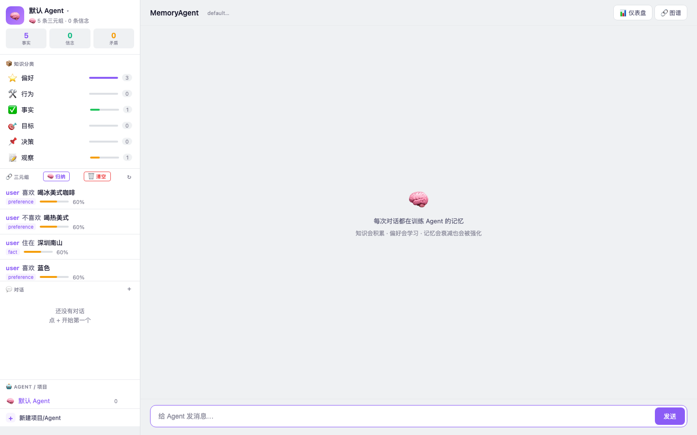
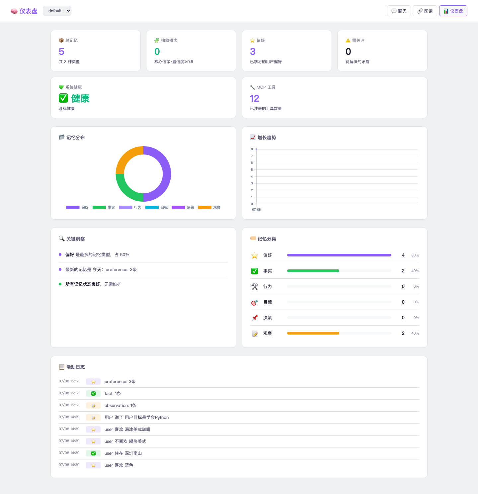
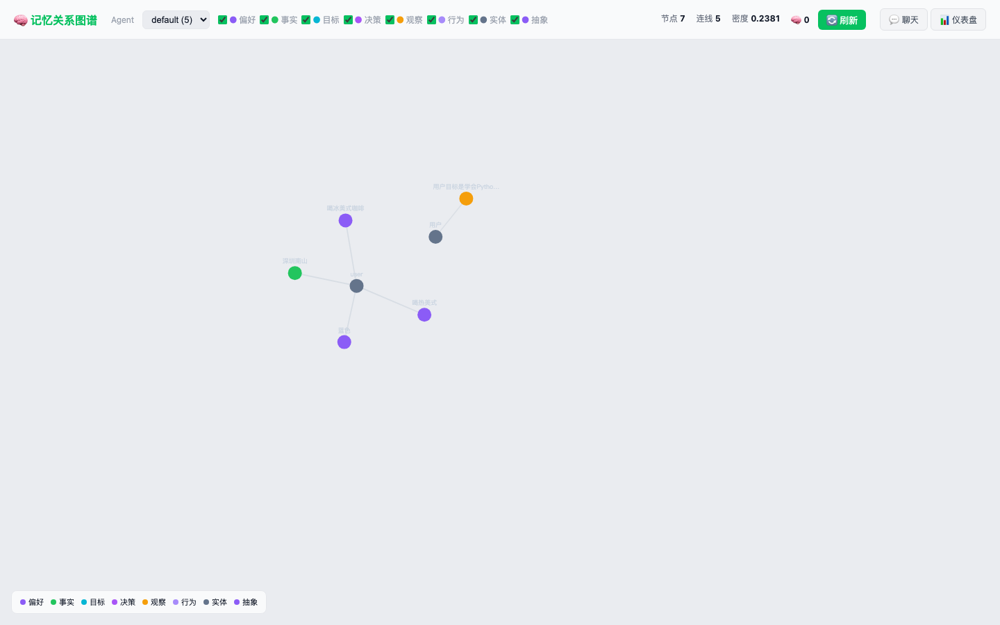

# 🧠 CogniMem — 认知记忆系统

> **Global AI Hackathon with QwenCloud | MemoryAgent 赛道**
>
> 大多数记忆系统直接把原文堆进上下文，要么费 token，要么关键词硬匹配召回不准。
>
> **CogniMem 遵循四大设计原则：**

<div align="center">

### 🧠 更智能 · 💰 更省 Token · ⚡ 更省资源 · 🚀 算法更创新

[](https://www.python.org/)
[](https://fastapi.tiangolo.com/)
[](https://dashscope.console.aliyun.com/)
[](https://www.postgresql.org/)
[](https://opensource.org/licenses/MIT)

**在线演示：** [http://42.121.253.80:8000](http://42.121.253.80:8000)

</div>

---

## 📸 界面截图

| 💬 聊天界面 | 📊 仪表盘 | 🔗 知识图谱 |
|:---:|:---:|:---:|
|  |  |  |

---

## 🧠 核心能力：记忆系统

### 存的是结构，不是文本

大多数记忆系统把对话原文直接存起来，召回时靠关键词硬匹配。CogniMem 不同——它把每句话实时拆解为 **SPO 三元组（主体-谓词-客体）**，构建可推理的知识网络：

| 你说的话 | 提取的结构 |
|:---------|:-----------|
| "我喜欢喝冰美式" | `(我, 喜欢, 喝冰美式)` |
| "我不喜欢喝热美式" | `(我, 不喜欢, 喝热美式)` |
| "我住在北京" | `(我, 住在, 北京)` |
| "我是一名程序员" | `(我, 职业, 程序员)` |

### 三层提取，token 趋零

```
L1 规则提取（0 token）：正则模板覆盖 70% 日常表达
L2 缓存复用（0 token）：相同句式命中缓存，直接返回
L3 LLM 提取（少量 token）：以上都不行才调 Qwen3.7-Plus
```

### 三层矛盾检测

| 层级 | 方法 | token | 说明 |
|:----|:----|:-----:|:-----|
| L1 | 否定词 Jaccard 匹配 | **0** | "喜欢" vs "不喜欢" → 矛盾 |
| L2 | Embedding 余弦相似度 | **0** | "咖啡" vs "火锅" → 不同偏好 |
| L3 | LLM 语义裁决 | **少量** | 前两层无法确定时 |

中性谓词自动跳过 / 跨类别偏好不误报。

### 碎片归纳

同类零散事实自动汇总为高层概念：

> `(我, 喜欢, 冰美式)` + `(我, 喜欢, 热美式)` → 抽象信念"用户对咖啡有偏好"

### 科学遗忘

艾宾浩斯遗忘曲线：`half_life = 24h × (1 + √access_count)`
常用记忆持久，不常用的自然衰减。每条记忆变化全程可追溯。

### 四层召回

```
Query → L0 缓存命中 → L1 Deny 过滤 → L2 Embedding 召回 → L3 图谱漫步
```

---

## 1️⃣ 🧠 更智能

### 12 个内置工具

| 工具 | 用途 |
|:----|:------|
| web_search | 联网搜索 |
| web_fetch | 抓取网页 |
| read_file / write_file | 文件读写 |
| shell | 执行命令 |
| python_repl / execute_code | 代码执行 |
| memory_recall / memory_diagnose / memory_status / memory_forget | 记忆操作 |
| visit_url | URL 访问 |

### 目标驱动 Agent 引擎

接收请求 → 自动规划步骤 → 逐轮执行 → 工具失败自动纠错 → 完成后自反思。

### 交互式仪表盘

4 指标卡（总记忆/抽象概念/偏好/需关注）+ 系统健康（5 维度）+ 记忆分布图 + 增长趋势 + 关键洞察 + 记忆分类 + 活动日志。自动 30 秒刷新。

### 知识图谱

力导向图，8 语义类型 + 抽象节点 + 类型筛选 + 详情面板。

---

## 2️⃣ 💰 更省 Token

| 场景 | 处理 | token |
|:----|:----|:-----:|
| "你好""再见" | is_simple bypass → 直出 | **0** |
| "我喜欢喝冰美式" | 正则规则提取 | **0** |
| 5 分钟内同样问题 | L0 缓存命中 | **0** |
| "喜欢" vs "不喜欢" | Jaccard 词法对比 | **0** |
| 语义相似度对比 | Embedding DB 内完成 | **0** |
| 复杂句式/归纳抽象 | 至此才调 Qwen3.7-Plus | **少量** |

---

## 3️⃣ ⚡ 更省资源

- **艾宾浩斯衰减**：冷数据置信度自动下降，不占空间
- **自动 consolidation**：空闲 5 秒触发合并/归纳/衰减/解矛盾
- **滑动窗口裁剪**：上下文超 24K token 自动剪，不爆窗口
- **PostgreSQL + pgvector**：启动 < 1 秒，不依赖外部缓存
- **稳定性**：DB 断连自恢复 / LLM 调用自动重试 3 次 / 全局异常捕获 / systemd 开机自启

---

## 4️⃣ 🚀 算法更创新

| 创新点 | 说明 |
|:------|:------|
| **矛盾驱动学习** | 检测到矛盾 → 主动提问确认 → 解决矛盾 → 认知升级 |
| **三元组结构推理** | `(?, 住在, 北京)` ∩ `(?, 职业, 程序员)` → 组合查询 |
| **噪音过滤** | curl/wget/ping 跳过 | web_fetch 跳过 | 同轮搜索只存一次 |
| **跨类别偏好** | "咖啡" vs "火锅" 不误判，只有同类相反才触发矛盾 |
| **科学遗忘** | 访问频率越高 half_life 越长，分层遗忘而非一刀切 |

---

## 🏗 架构

```
浏览器 → FastAPI（15+ 端点）→ Agent 引擎（12 工具）
  → CogniMem 核心（提取/衰减/矛盾/归纳）
  → PostgreSQL + pgvector → Qwen3.7-Plus
```

---

## 🚀 快速开始

```bash
git clone https://github.com/yourusername/qwen-memoryagent.git
cd qwen-memoryagent
python3 -m venv .venv && source .venv/bin/activate
pip install -e ".[all]"
cp .env.template .env   # 填入 QWEN_API_KEY + COGNIMEM_DB
cd src && python3 -m uvicorn memory_agent.main:app --host 0.0.0.0 --port 8000
```

---

## 📡 API

| 方法 | 端点 | 用途 |
|:----|:-----|:------|
| POST | `/chat` | 带记忆对话（12 工具）|
| GET | `/chat/stream` | 流式对话 |
| POST | `/remember` | 存记忆 |
| POST | `/recall` | 查记忆 |
| GET | `/health` | 5 维度健康检测 |
| GET | `/stats` | 记忆统计 |
| POST | `/consolidate` | 触发整合 |
| POST | `/confirm` / `/challenge` | 置信度操作 |
| GET | `/versions/{id}` | 版本历史 |
| GET | `/memory-graph` | 图谱数据 |
| GET | `/memories` / `/memories/search` | 记忆管理 |

---

## 🧪 测试

```
24+ 项全部通过

Agent 行为    9/9  ✅  搜索/早停/上下文分离/路由/文件/分析
核心引擎      6/6  ✅  存储/召回/矛盾/置信度/整合/清空
流式         2/2  ✅  SSE 基础/路由
噪音过滤      3/3  ✅  curl过滤/个人信息/搜索去重
边缘情况      3/3  ✅  参数校验/图谱错误/并发
```

---

## ✅ 成果

- **健康分 100**：5 维度全绿
- **零 HTTP 500**
- **12 工具**完整集成
- **记忆零噪音**
- **知识图谱** 8 类型 + 抽象节点

---

## 📄 License

MIT — Built for the Global AI Hackathon with QwenCloud.
