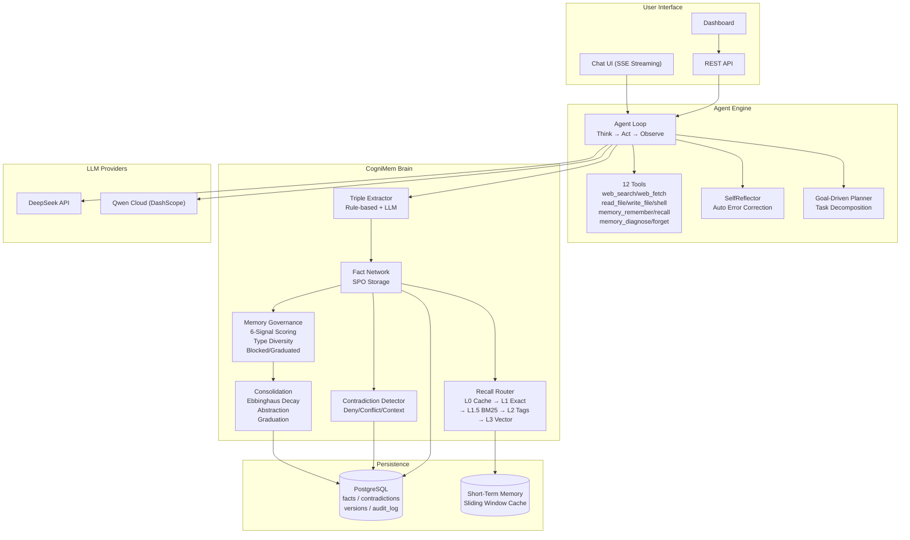

# CogniMem Architecture



## Data Flow

```
User Message
    │
    ▼
┌─────────────────────┐
│  Simple or Complex?  │
│  (rule-based check)  │
└──────┬──────┬───────┘
       │      │
    Simple  Complex
       │      │
       ▼      ▼
  ┌────────┐  ┌──────────────────┐
  │ Direct  │  │ Agent Loop       │
  │ LLM     │  │ 1. Recall Memory │
  │ Reply   │  │ 2. Plan Steps    │
  └────────┘  │ 3. Execute Tools  │
              │ 4. Store Results  │
              │ 5. Self-Reflect   │
              └──────────────────┘
                      │
                      ▼
              ┌──────────────────┐
              │  Consolidation   │
              │ • Ebbinghaus     │
              │ • Contradiction  │
              │ • Graduation     │
              └──────────────────┘
```

## Memory Lifecycle

```
New Info → Extract Triple → Score (6 signals) → Store
    ↓
Cache (L0) → Exact Match (L1) → BM25 (L1.5) → Tags (L2) → Vector (L3)
    ↓
After session: Consolidation → Ebbinghaus Decay → Contradiction Scan
    ↓
After 7+ days unused + 10+ accesses: Graduation (retired from context)
    ↓
Contradicted 3+ times OR confidence < 0.15: Blocked
```

## Deployment

```
┌──────────────┐     HTTPS/SSE      ┌──────────────────┐
│  User Browser │ ◄──────────────► │  Alibaba Cloud    │
│  (Chat UI)    │                   │  ECS (47.99.x.x)  │
└──────────────┘                   │  Port 8000        │
                                    │  systemd service  │
                                    │  PostgreSQL 13    │
                                    └──────────────────┘
```
